# Лабораторная работа № 6. Интеграция рекламных сервисов в интерактивное приложение
Отчет по лабораторной работе №6 выполнил:
- Строшков Артем Валерьевич
- РИ-300004

Отметка о выполнении заданий (заполняется студентом):

| Задание | Выполнение | Баллы |
| ------ | ------ | ------ |
| Задание 1 | * |  |
| Задание 2 | # |  |
| Задание 3 | # |  |

знак "*" - задание выполнено; знак "#" - задание не выполнено;

Работу проверили:
- к.т.н., доцент Денисов Д.В.
- к.э.н., доцент Панов М.А.
- ст. преп., Фадеев В.О.

[](https://nodesource.com/products/nsolid)

[](https://travis-ci.org/joemccann/dillinger)

Структура отчета

- Данные о работе: название работы, фио, группа, выполненные задания.
- Цель работы.
- Задание 1.
- Код реализации выполнения задания. Визуализация результатов выполнения (если применимо).
- Задание 2.
- Код реализации выполнения задания. Визуализация результатов выполнения (если применимо).
- Задание 3.
- Код реализации выполнения задания. Визуализация результатов выполнения (если применимо).
- Выводы.
- ✨Magic ✨

## Цель работы
Cоздание интерактивного приложения с рейтинговой системой пользователя и интеграция игровых сервисов в готовое приложение.
## Задание 1
### Используя видео-материалы практических работ 1-5 повторить реализацию приведенного ниже функционала:
###– 1 Практическая работа «Интеграция баннерной рекламы»
###– 2 Практическая работа «Интеграция видеорекламы»
###– 3 Практическая работа «Показ видеорекламы пользователю за вознаграждение»
###– 4 Практическая работа «Создание внутриигрового магазина»
###– 5 Практическая работа «Система антиблокировки рекламы»

#### Ход работы (задание 1).
1) Подключить монетизацию в аккаунте Яндекс
2) Создать RTB блок в РСЯ(десктпоный формат)

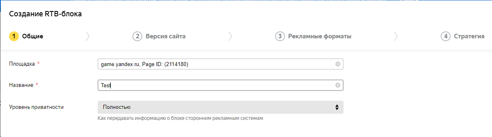

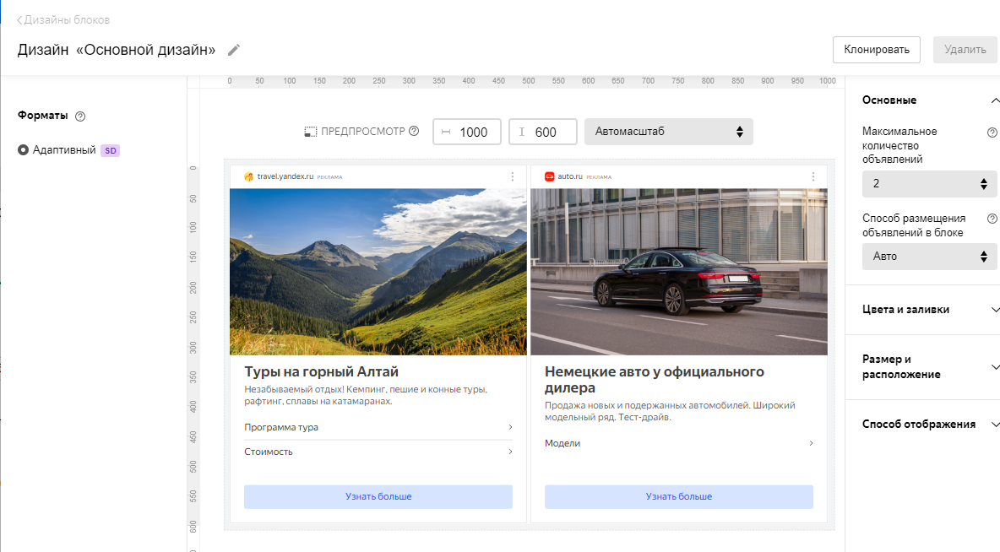

3) Добавить индектификатор RTB в слот для статичной рекламы через настройки проекта unity

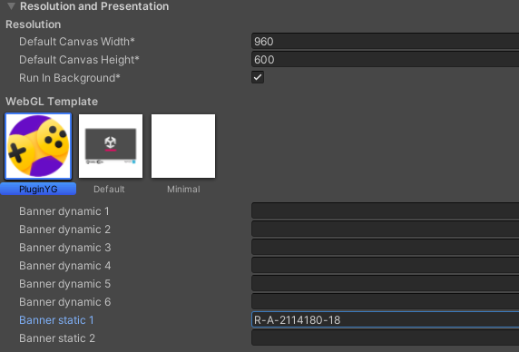

4) Собрать билд под WebGL и заргузить в консоль разработчика YG
5) Проверить появление рекламных банеров через черновик игры
6) Настроить InfoYG

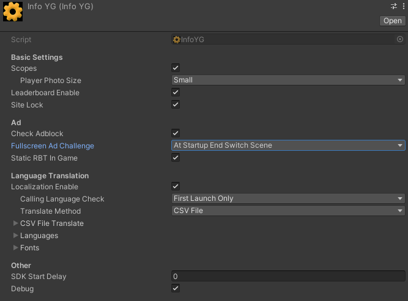

7) Протестировать игру через черновик после проверки
8) Изменить скрипт DragonPicker.cs

```cs

    public void DragonEggDestroyed(){
        int shieldIndex = shieldList.Count - 1;
        GameObject tShieldGo = shieldList[shieldIndex];
        shieldList.RemoveAt(shieldIndex);
        Destroy(tShieldGo);

        if (shieldList.Count == 0) {
            GameObject scoreGO = GameObject.Find("Score");
            scoreGT = scoreGO.GetComponent<TextMeshProUGUI>();
            var achs = YandexGame.savesData.achivments;
            achs[0] = "Береги щиты!";
            UserSave(int.Parse(scoreGT.text), YandexGame.savesData.bestScore, achs);
            YandexGame.NewLeaderboardScores("TopPlayerScore", int.Parse(scoreGT.text));
            YandexGame.RewVideoShow(0);
            SceneManager.LoadScene("_0Scene");
            GetLoadSave();
        }
    }

```

9) Изменить скрипт CheckConnectYG.cs

```cs

public void CheckSDK()
    {
        if (YandexGame.auth == true)
        {
            Debug.Log("User auth OK");
        }
        else
        {
            Debug.Log("User not auth");
            YandexGame.AuthDialog();
        }
        YandexGame.RewVideoShow(0);
        GameObject scoreGO = GameObject.Find("BestScore");
        scoreBest = scoreGO.GetComponent<TextMeshProUGUI>();
        scoreBest.text = "Best Score: " + YandexGame.savesData.bestScore.ToString();

        if(YandexGame.savesData.achivments == null && GameObject.Find("ListAchievements") == null){

        }
        else{
            foreach(string value in YandexGame.savesData.achivments){
                achievements.text = achievements.text + value + Environment.NewLine;
            }
        }
    }

```

10) Настроить объект YandexGame на обоих сценах

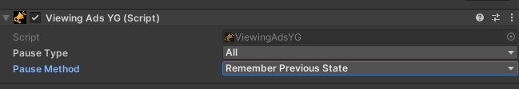

11) Собрать билд под WebGL и заргузить в консоль разработчика YG, протестировать

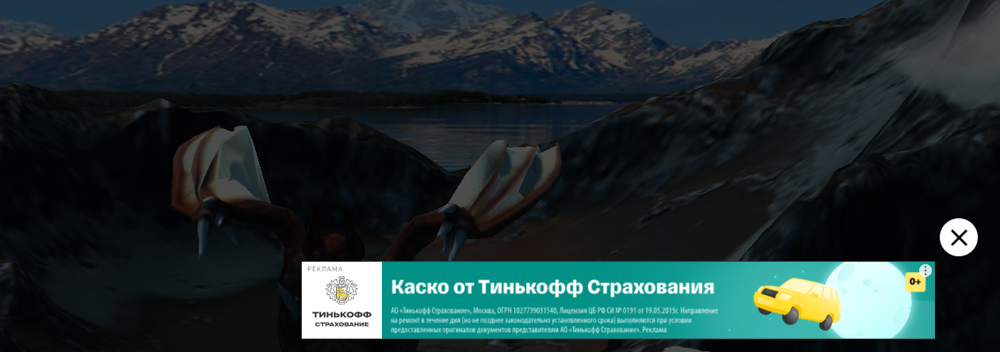

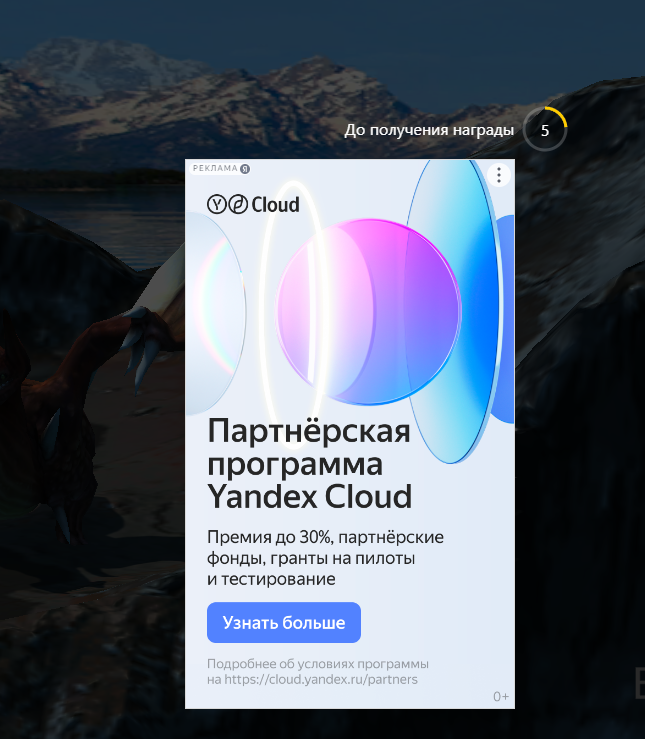

12) Создать скрипт ADReward.cs, подключить к YandexManager

```cs

    using System.Collections;
using System.Collections.Generic;
using UnityEngine;
using YG;

public class ADReward : MonoBehaviour
{
    private void OnEnable() {
        YandexGame.CloseVideoEvent += Rewarded;
    }

    private void OnDisable() {
        YandexGame.CloseVideoEvent -= Rewarded;
    }

    void Rewarded(int id){
        if (id==1){
            Debug.Log("Пользователь получил вознаграждение");
        }
        else{
            Debug.Log("Пользователь не получил вознаграждение");
        }
    }

    public void OpenAD(){
        YandexGame.RewVideoShow(Random.Range(0, 2));
    }
}


```

13) Создать кнопку для вызова рекламы

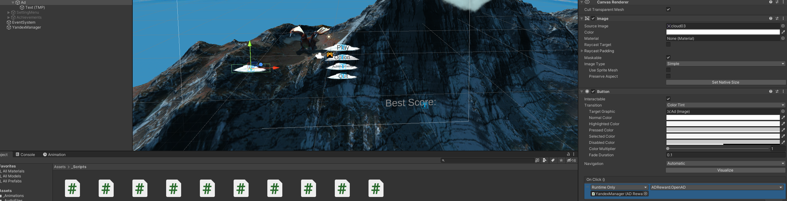

14) Собрать билд, проверить новую функцию

15) Добавить на сцену объект OnePurchase, настроить его позицию

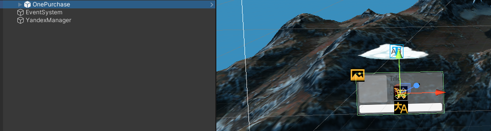

16) Добавить товар для продажи через консоль YG

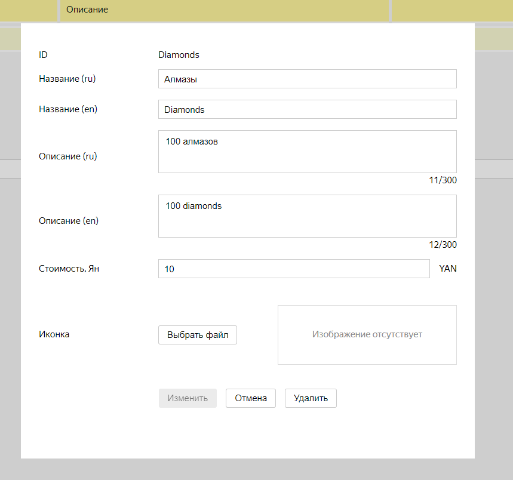

17) Настроить OnePurchase


18) Проверить через черновки из консоли разработчика


19) Проверить, что включена проверка блокировщика рекламы

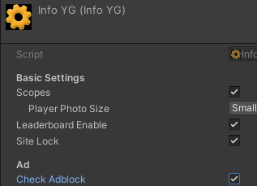

20) Проверить работу рекламы с включенным в браузере блокировщиком(через черновик). Пользователь не полчит вознаграждение, в случае включенного блокировщика

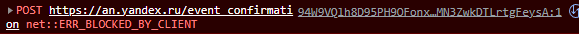

## Задание 2
### Добавить в приложение интерфейс для вывода статуса наличия игрока в сети (онлайн или офлайн).

#### Ход работы (задание 2).


## Задание 3
### Предложить наиболее подходящий на ваш взгляд способ монетизации игры D.Picker. Дать развернутый ответ с комментариями.

#### Ход работы (задание 3).


## Выводы
- Реализованы следющие элементы игры: реклама в виде банеров, видео, реклама с наградой, система внутриигровых покупок

